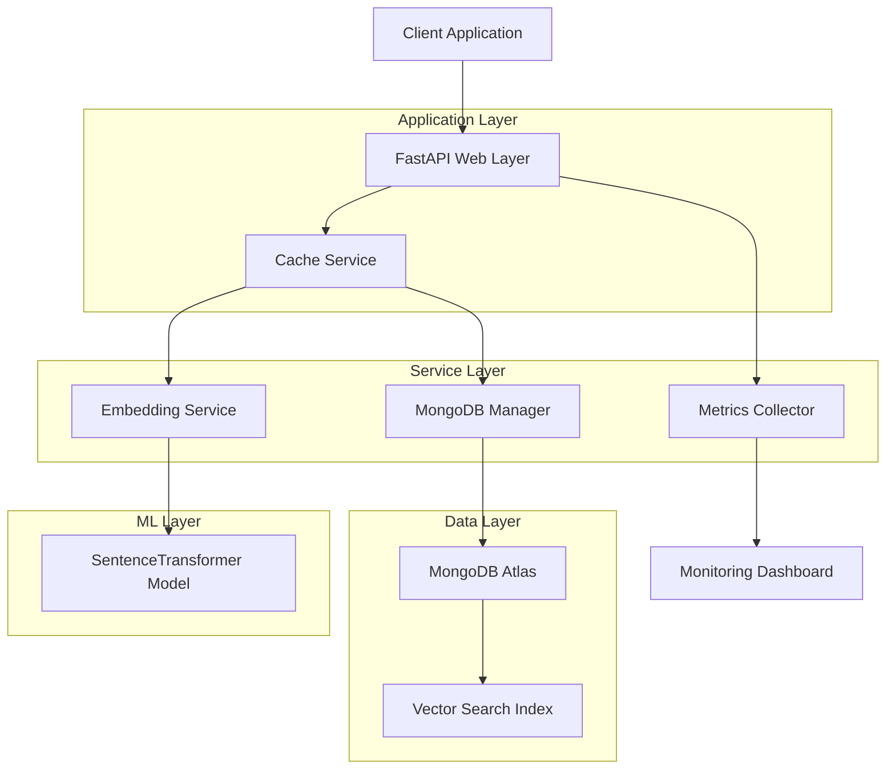
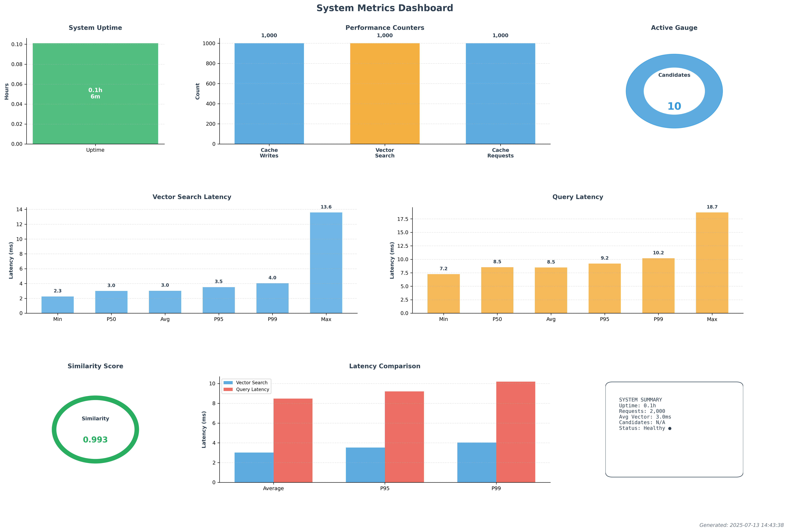

# MongoDB Semantic Cache

## Table of Contents
1. [Overview](#overview)
2. [System Architecture](#system-architecture)
3. [Components](#components)
4. [Installation & Deployment](#installation--deployment)
5. [Configuration](#configuration)
6. [Usage](#usage)
7. [API Reference](#api-reference)
8. [Security Considerations](#security-considerations)
9. [Monitoring & Logging](#monitoring--logging)
10. [Troubleshooting](#troubleshooting)
11. [Development Guide](#development-guide)
12. [Maintenance & Operations](#maintenance--operations)

## 1. Overview

The MongoDB Semantic Cache is a high-performance caching system that utilizes semantic similarity matching to store and retrieve query-response pairs. This intelligent caching layer goes beyond traditional exact-match caching by understanding the meaning behind queries and returning cached responses for semantically similar requests.

**Key Features:**
- Semantic similarity matching using sentence transformers
- MongoDB Atlas vector search capabilities
- RESTful API for cache operations
- Comprehensive metrics and monitoring
- Automatic TTL-based cache expiration
- User-scoped cache isolation
- Real-time performance analytics

**Problem Solved:**
Traditional caching systems require exact query matches, missing opportunities to serve cached responses for semantically similar queries. This system addresses the limitation by implementing vector-based similarity matching, significantly improving cache hit rates and reducing response times for applications with natural language queries.

**Target Audience:**
- API developers implementing intelligent caching layers
- Applications with natural language processing requirements
- Systems requiring user-scoped semantic search capabilities
- Organizations seeking to reduce computational costs through smarter caching

## 2. System Architecture

The MongoDB Semantic Cache follows a layered architecture design with clear separation of concerns:



The architecture implements a microservices pattern with the following key characteristics:

- **Stateless Design**: All services are stateless, enabling horizontal scaling
- **Event-Driven Metrics**: Asynchronous metrics collection without blocking operations
- **Connection Pooling**: Efficient MongoDB connection management
- **Lazy Loading**: Models and connections initialize on first use
- **Fault Tolerance**: Graceful degradation when services are unavailable

## 3. Components

### 3.1 FastAPI Web Layer (`main.py`)

The FastAPI application serves as the HTTP interface for the semantic cache system. It provides RESTful endpoints with automatic request/response validation, health checking, and dependency injection.

**Technologies Used:**
- FastAPI for web framework
- Pydantic for data validation
- Uvicorn for ASGI server

**Core Functionality:**
- HTTP endpoint routing and request handling
- Automatic API documentation generation
- Lifespan management for startup/shutdown procedures
- Dependency injection for service management
- Health check endpoints for monitoring

**Interactions:**
- Receives HTTP requests from clients
- Delegates business logic to CacheService
- Returns structured JSON responses
- Integrates with metrics collection system

### 3.2 Cache Service (`services/cache_service.py`)

The CacheService orchestrates the core caching logic, coordinating between embedding generation and database operations.

**Technologies Used:**
- AsyncIO for asynchronous operations
- Python time module for performance measurement

**Core Functionality:**
- Query embedding generation coordination
- Vector similarity search execution
- Cache entry storage and retrieval
- Performance metrics recording
- Error handling and logging

**Interactions:**
- Utilizes EmbeddingService for vector generation
- Communicates with MongoDBManager for data persistence
- Reports metrics to MetricsCollector
- Provides service information to API layer

### 3.3 Embedding Service (`services/embedding_service.py`)

The EmbeddingService handles text-to-vector conversion using the all-MiniLM-L6-v2 sentence transformer model.

**Technologies Used:**
- SentenceTransformers library
- PyTorch for model execution
- AsyncIO for non-blocking operations

**Core Functionality:**
- Sentence transformer model loading and management
- Text embedding generation (384-dimensional vectors)
- Batch processing capabilities
- Device optimization (CPU/MPS support)

**Interactions:**
- Loads pre-trained transformer models
- Provides embeddings to CacheService
- Executes in thread pool to avoid blocking
- Supports both single and batch processing

### 3.4 MongoDB Manager (`database/mongodb.py`)

The MongoDBManager handles all database operations including connection management, index creation, and data operations.

**Technologies Used:**
- PyMongo for MongoDB connectivity
- MongoDB Atlas for cloud database
- Vector search capabilities

**Core Functionality:**
- Connection pool management
- Vector search index creation and management
- TTL index configuration for automatic cleanup
- Cache entry insertion and retrieval
- Vector similarity search execution

**Interactions:**
- Manages persistent connections to MongoDB Atlas
- Executes vector search queries
- Handles database initialization and schema setup
- Provides data persistence for cache entries

### 3.5 Metrics Collector (`monitoring/metrics.py`)

The MetricsCollector implements comprehensive monitoring without external dependencies.

**Technologies Used:**
- Python collections for data structures
- Time-based measurements
- Statistical calculations

**Core Functionality:**
- Counter, gauge, and histogram metrics
- Percentile calculations (P50, P95, P99)
- Metric aggregation and summarization
- Memory-efficient data retention

**Interactions:**
- Collects performance data from all services
- Provides metrics summaries to API endpoints
- Supports real-time monitoring dashboards
- Maintains rolling windows of historical data

## 4. Installation & Deployment

### 4.1 Prerequisites

**Software Requirements:**
- Python 3.12 or higher
- MongoDB Atlas account with cluster access
- Docker (optional, for containerized deployment)
- Git for source code management

**Hardware Requirements:**
- Minimum 4GB RAM for model loading
- 2+ CPU cores for optimal performance
- Network connectivity to MongoDB Atlas

### 4.2 Local Development Setup

1. **Clone the Repository:**
```bash
git clone <repository-url>
cd semantic-cache
```

2. **Install Dependencies:**
```bash
pip install -r requirements.txt
```

3. **Configure Environment Variables:**
```bash
cp .env.example .env
# Edit .env with your MongoDB Atlas connection string
```

4. **Initialize Database:**
The database will be automatically initialized on first startup.

5. **Start the Application:**
```bash
python main.py
```

### 4.3 Docker Deployment

1. **Build Docker Image:**
```bash
docker build -t semantic-cache .
```

2. **Run with Docker Compose:**
```bash
docker-compose up -d
```

3. **Verify Deployment:**
```bash
curl http://localhost:8183/health
```

### 4.4 Production Deployment

For production environments, consider:

1. **Environment Configuration:**
- Set `DEBUG=false`
- Configure appropriate `CACHE_TTL_SECONDS`
- Adjust `SIMILARITY_THRESHOLD` based on use case

2. **Load Balancing:**
- Deploy multiple instances behind a load balancer
- Use sticky sessions if required

3. **Monitoring Setup:**
- Configure external monitoring tools
- Set up alerting for health check failures
- Monitor MongoDB Atlas metrics

## 5. Configuration

### 5.1 Environment Variables

The application uses environment variables for configuration, loaded from a `.env` file:

```bash
# MongoDB Configuration
MONGODB_URI=mongodb+srv://<user>:<password>@cluster.mongodb.net/
MONGODB_DATABASE=semantic_cache
MONGODB_COLLECTION=cache
VECTOR_SEARCH_INDEX_NAME=cache_vector_index

# Application Settings
APP_NAME=MongoDB-Semantic-Cache
APP_VERSION=2.0
DEBUG=false
SERVICE_HOST=0.0.0.0
SERVICE_PORT=8183

# Cache Configuration
CACHE_TTL_SECONDS=259200  # 3 days
SIMILARITY_THRESHOLD=0.85
DEFAULT_NUM_CANDIDATES=10
MAX_QUERY_LIMIT=1

# Features
LOG_VECTOR_METRICS=true
```

### 5.2 Configuration Parameters

**MongoDB Settings:**
- `MONGODB_URI`: Connection string for MongoDB Atlas cluster
- `MONGODB_DATABASE`: Database name for cache storage
- `MONGODB_COLLECTION`: Collection name for cache entries
- `VECTOR_SEARCH_INDEX_NAME`: Name of the vector search index

**Cache Behavior:**
- `CACHE_TTL_SECONDS`: Time-to-live for cache entries (default: 3 days)
- `SIMILARITY_THRESHOLD`: Minimum similarity score for cache hits (0.0-1.0)
- `DEFAULT_NUM_CANDIDATES`: Number of candidates for vector search
- `MAX_QUERY_LIMIT`: Maximum results returned per search

**Performance Tuning:**
- Lower `SIMILARITY_THRESHOLD` increases cache hit rate but may reduce accuracy
- Higher `DEFAULT_NUM_CANDIDATES` improves search quality but increases latency
- Adjust `CACHE_TTL_SECONDS` based on data freshness requirements

## 6. Usage

### 6.1 Basic Operations

The semantic cache supports two primary operations: saving entries and retrieving cached responses.

**Saving to Cache:**
Store a query-response pair with automatic embedding generation:

```bash
curl -X POST http://localhost:8183/save_to_cache \
  -H "Content-Type: application/json" \
  -d '{
    "user_id": "user123",
    "query": "What are the airport security requirements?",
    "response": "You must remove laptops, liquids over 3.4oz, and pass through metal detectors."
  }'
```

**Retrieving from Cache:**
Query for semantically similar cached responses:

```bash
curl -X POST http://localhost:8183/read_cache \
  -H "Content-Type: application/json" \
  -d '{
    "user_id": "user123",
    "query": "Airport security rules and regulations?",
    "threshold": 0.8
  }'
```

### 6.2 Common Use Cases

**Customer Support Automation:**
Cache frequently asked questions with their answers, enabling automatic responses for similar queries.

**Content Recommendation:**
Store user preferences and content mappings to provide personalized recommendations based on semantic similarity.

**Knowledge Base Search:**
Implement intelligent search across documentation by caching query-answer pairs from previous searches.

### 6.3 Integration Examples

**Python Client Example:**
```python
import httpx
import asyncio

async def semantic_cache_example():
    async with httpx.AsyncClient() as client:
        # Save to cache
        save_response = await client.post("http://localhost:8183/save_to_cache", json={
            "user_id": "demo_user",
            "query": "How do I reset my password?",
            "response": "Click 'Forgot Password' and follow the email instructions."
        })
        
        # Query cache
        query_response = await client.post("http://localhost:8183/read_cache", json={
            "user_id": "demo_user",
            "query": "I can't remember my login password"
        })
        
        result = query_response.json()
        if result["response"] != "cache_miss":
            print(f"Cache hit! Response: {result['response']}")
            print(f"Similarity: {result['similarity_score']:.3f}")

asyncio.run(semantic_cache_example())
```

## 7. API Reference

### 7.1 Health Check Endpoints

**GET /health**
- **Description:** Basic health check endpoint
- **Response:** `{"status": "healthy", "timestamp": "2024-01-01T12:00:00"}`
- **Status Codes:** 200 (OK)

**GET /health/detailed**
- **Description:** Comprehensive health check including dependencies
- **Response:** 
```json
{
  "status": "healthy",
  "checks": {
    "mongodb": "healthy",
    "embedding_service": "healthy"
  },
  "timestamp": "2024-01-01T12:00:00"
}
```
- **Status Codes:** 200 (OK), 503 (Service Unavailable)

### 7.2 Cache Operations

**POST /save_to_cache**
- **Description:** Store a query-response pair in the semantic cache
- **Request Body:**
```json
{
  "user_id": "string",
  "query": "string",
  "response": "string",
  "timestamp": "2024-01-01T12:00:00Z" // optional
}
```
- **Response:**
```json
{
  "message": "Successfully saved to cache"
}
```
- **Status Codes:** 200 (OK), 400 (Bad Request), 500 (Internal Error)

**POST /read_cache**
- **Description:** Query the cache for semantically similar entries
- **Request Body:**
```json
{
  "user_id": "string",
  "query": "string",
  "threshold": 0.85 // optional, 0.0-1.0
}
```
- **Response (Cache Hit):**
```json
{
  "response": "string",
  "latency_ms": 45.2,
  "similarity_score": 0.892
}
```
- **Response (Cache Miss):**
```json
{
  "response": "cache_miss",
  "latency_ms": 32.1
}
```
- **Status Codes:** 200 (OK), 400 (Bad Request), 500 (Internal Error)

### 7.3 Monitoring Endpoints

**GET /metrics**
- **Description:** Retrieve comprehensive system metrics
- **Response:**
```json
{
  "uptime_seconds": 3600,
  "counters": {
    "cache_requests": 150,
    "cache_writes": 75
  },
  "gauges": {
    "candidates": 100
  },
  "histograms": {
    "vector_search_latency_ms": {
      "count": 100,
      "avg": 45.2,
      "p50": 42.1,
      "p95": 89.3,
      "p99": 120.5
    }
  }
}
```
- **Status Codes:** 200 (OK)

**GET /service-info**
- **Description:** Get service configuration information
- **Response:**
```json
{
  "embedding_model": "sentence-transformers/all-MiniLM-L6-v2",
  "embedding_dimensions": 384,
  "default_similarity_threshold": 0.85
}
```
- **Status Codes:** 200 (OK)

## 8. Security Considerations

### 8.1 Authentication and Authorization

**Current Implementation:**
The system currently operates without built-in authentication. User isolation is achieved through the `user_id` field in requests.

**Recommended Enhancements:**
- Implement JWT-based authentication
- Add API key validation for service access
- Use OAuth2 for enterprise integrations
- Validate user permissions before cache access

### 8.2 Data Encryption

**MongoDB Atlas Security:**
- All data transmitted to/from MongoDB Atlas is encrypted in transit using TLS 1.2+
- Data at rest encryption is enabled by default in MongoDB Atlas
- Connection strings should use secure protocols (mongodb+srv://)

**Application Level Security:**
- Sensitive environment variables should be encrypted
- Consider encrypting cached response data for sensitive applications
- Implement field-level encryption for personally identifiable information

### 8.3 Network Security

**Production Deployment Security:**
- Deploy behind a reverse proxy (nginx, Apache)
- Use HTTPS/TLS for all client communications
- Implement rate limiting to prevent abuse
- Configure firewall rules to restrict database access
- Use MongoDB Atlas IP whitelisting

### 8.4 Input Validation

**Implemented Protections:**
- Pydantic models validate all input data types and formats
- Query length limits prevent excessive memory usage
- User ID validation prevents injection attacks

**Additional Recommendations:**
- Implement content filtering for inappropriate queries
- Add input sanitization for special characters
- Monitor for unusual query patterns that might indicate abuse

## 9. Monitoring & Logging

### 9.1 Metrics Collection

The system implements comprehensive metrics collection without external dependencies:

**Counter Metrics:**
- `cache_requests`: Total cache lookup requests by user and hit status
- `cache_writes`: Total cache save operations by status
- `vector_search`: Total vector searches by result type

**Gauge Metrics:**
- `candidates`: Last number of search candidates used
- System resource utilization metrics

**Histogram Metrics:**
- `query_latency_ms`: End-to-end query processing time
- `vector_search_latency_ms`: Database vector search performance
- `cache_save_latency_ms`: Cache save operation performance
- `similarity_score`: Distribution of similarity scores

### 9.2 Performance Monitoring

**Key Performance Indicators:**
- Average query latency (target: <100ms)
- Cache hit rate (target: >70%)
- Vector search performance (target: <50ms)
- System uptime and availability

**Metrics Dashboard:**
The included `show_metrics.py` script generates visual dashboards displaying:
- Real-time performance graphs
- Latency percentile distributions
- System health summaries
- Historical trend analysis




### 9.3 Logging Strategy

**Log Categories:**
- **INFO**: Successful operations, cache hits/misses, performance metrics
- **DEBUG**: Detailed execution traces (when DEBUG=true)
- **WARNING**: Non-critical issues, fallback operations
- **ERROR**: Failed operations, connection issues, data corruption
- **CRITICAL**: System failures, startup/shutdown events

**Log Destinations:**
- Console output for development environments
- File-based logging (`logs/MongoDB-Semantic-Cache.log`)
- Structured logging format for log aggregation systems

**Log Retention:**
- Implement log rotation to manage disk usage
- Archive historical logs for compliance requirements
- Consider centralized logging for distributed deployments

## 10. Troubleshooting

### 10.1 Common Issues and Solutions

**Connection Errors:**

*Issue:* `Failed to initialize MongoDB Manager`
*Solution:*
1. Verify MongoDB Atlas connection string in environment variables
2. Check network connectivity to Atlas cluster
3. Confirm database user permissions
4. Validate IP whitelist settings in Atlas

*Issue:* `Service initialization failed`
*Solution:*
1. Check Python dependencies installation
2. Verify model download completion
3. Ensure sufficient memory for model loading
4. Review application logs for specific error details

**Performance Issues:**

*Issue:* High query latency (>200ms)
*Solution:*
1. Check MongoDB Atlas cluster performance metrics
2. Verify vector search index exists and is built
3. Reduce `DEFAULT_NUM_CANDIDATES` for faster searches
4. Consider upgrading Atlas cluster tier

*Issue:* Low cache hit rate (<30%)
*Solution:*
1. Lower `SIMILARITY_THRESHOLD` to increase hit rate
2. Verify queries are semantically related
3. Check user_id isolation isn't too restrictive
4. Analyze query patterns for optimization opportunities

### 10.2 Debugging Steps

**1. Health Check Validation:**
```bash
curl http://localhost:8183/health/detailed
```
Verify all components report "healthy" status.

**2. Metrics Analysis:**
```bash
curl http://localhost:8183/metrics
```
Review latency histograms and error counters for patterns.

**3. Log File Examination:**
```bash
tail -f logs/MongoDB-Semantic-Cache.log
```
Monitor real-time logs for error messages and performance indicators.

**4. Database Connectivity:**
Test MongoDB connection independently:
```python
from pymongo import MongoClient
client = MongoClient("your-connection-string")
print(client.admin.command('ismaster'))
```

### 10.3 Error Codes and Messages

**HTTP Status Codes:**
- `200`: Successful operation
- `400`: Invalid request parameters or malformed JSON
- `500`: Internal server error, database connection failure
- `503`: Service unavailable, dependency failure

**Common Error Messages:**
- `"Embedding generation failed"`: Model loading or text processing error
- `"Database insert failed"`: MongoDB write operation failure
- `"cache_miss"`: No semantically similar entry found
- `"Service initialization failed"`: Startup dependency error

## 11. Development Guide

### 11.1 Codebase Organization

The project follows a modular architecture with clear separation of concerns:

```
semantic-cache/
├── main.py                 # FastAPI application entry point
├── config.py              # Configuration management
├── requirements.txt       # Python dependencies
├── Dockerfile            # Container configuration
├── docker-compose.yml    # Multi-container orchestration
├── .env                  # Environment variables
├── database/
│   └── mongodb.py        # Database management and operations
├── models/
│   └── pydantic_models.py # Data validation models
├── monitoring/
│   └── metrics.py        # Metrics collection and analysis
├── services/
│   ├── cache_service.py  # Core caching logic
│   └── embedding_service.py # Text-to-vector conversion
├── utils/
│   └── logger.py         # Logging configuration
└── logs/                 # Application logs directory
```

### 11.2 Development Environment Setup

**1. Setup Virtual Environment:**
```bash
python -m venv semantic-cache-env
source semantic-cache-env/bin/activate  # Linux/Mac
# or
semantic-cache-env\Scripts\activate     # Windows
```

**2. Install Development Dependencies:**
```bash
pip install -r requirements.txt
```

### 11.3 Testing Procedures

**Unit Testing Framework:**
The project supports comprehensive testing with pytest and asyncio support:

```python
# test_cache_service.py
import pytest
import asyncio
from services.cache_service import CacheService
from models.pydantic_models import CacheEntry, QueryRequest

@pytest.mark.asyncio
async def test_cache_save_and_retrieve():
    cache_service = CacheService()
    
    # Test save operation
    entry = CacheEntry(
        user_id="test_user",
        query="Test query",
        response="Test response"
    )
    
    result = await cache_service.save_to_cache(entry)
    assert "Successfully saved" in result["message"]
    
    # Test retrieval
    query = QueryRequest(
        user_id="test_user", 
        query="Test query similar"
    )
    
    response = await cache_service.lookup_cache(query)
    assert response["response"] != "cache_miss"
```

**Integration Testing:**
Use the provided test scripts:
- `test_save.py`: Tests cache storage operations with various query patterns
- `test_read.py`: Tests cache retrieval with similarity matching
- `show_metrics.py`: Validates metrics collection and visualization

**Load Testing:**
```python
# Performance testing example
async def load_test():
    async with httpx.AsyncClient() as client:
        tasks = []
        for i in range(1000):
            task = client.post("http://localhost:8183/read_cache", 
                             json={"user_id": f"user{i}", "query": "test query"})
            tasks.append(task)
        
        responses = await asyncio.gather(*tasks)
        # Analyze response times and success rates
```

### 11.4 Code Style and Standards

**Python Code Standards:**
- Follow PEP 8 style guidelines
- Use type hints for function parameters and return values
- Implement comprehensive docstrings for classes and methods
- Use async/await for I/O operations

**API Design Principles:**
- RESTful endpoint design with appropriate HTTP methods
- Consistent error response formats
- Comprehensive input validation with Pydantic models
- Clear API documentation with FastAPI automatic generation

**Database Design Patterns:**
- Connection pooling for performance optimization
- Singleton pattern for service managers
- Graceful error handling for database operations
- Automatic index management and schema initialization

## 12. Maintenance & Operations

### 12.1 Scheduled Maintenance Tasks

**Daily Operations:**
- Monitor system health through `/health/detailed` endpoint
- Review metrics for performance anomalies
- Check MongoDB Atlas cluster health and performance
- Validate log files for error patterns

**Weekly Maintenance:**
- Analyze cache hit rate trends and optimize similarity thresholds
- Review and archive log files
- Update application dependencies if security patches available
- Performance capacity planning based on usage metrics

**Monthly Operations:**
- Complete system backup verification
- Security audit of access patterns and permissions
- Performance benchmarking and optimization
- Documentation updates for configuration changes

### 12.2 Backup and Recovery

**Data Backup Strategy:**
MongoDB Atlas provides automated backup with point-in-time recovery:
- Continuous incremental backups
- Configurable backup retention periods
- Cross-region backup replication for disaster recovery

**Application State Recovery:**
- Stateless application design enables rapid recovery
- Container-based deployment supports quick restarts
- Configuration management through environment variables
- Model weights cached locally for faster startup

**Recovery Procedures:**
1. **Database Recovery**: Use MongoDB Atlas backup restoration
2. **Application Recovery**: Redeploy containers with updated configuration
3. **Model Recovery**: Models automatically download on service startup
4. **Metrics Recovery**: Historical metrics rebuild from database queries

### 12.3 Scaling Strategies

**Horizontal Scaling:**
- Deploy multiple application instances behind load balancer
- Use container orchestration (Kubernetes, Docker Swarm)
- Implement service mesh for inter-service communication
- Database read replicas for query distribution

**Vertical Scaling:**
- Increase MongoDB Atlas cluster tier for higher performance
- Upgrade application server resources for model processing
- Optimize memory allocation for embedding model caching
- Use GPU acceleration for large-scale embedding generation

**Performance Optimization:**
- Implement connection pooling optimization
- Cache frequently accessed embeddings in memory
- Use batch processing for multiple concurrent requests
- Optimize vector search index configuration

### 12.4 Version Management

**Rolling Updates:**
- Use blue-green deployment strategy for zero-downtime updates
- Implement database schema versioning for backward compatibility
- Feature flags for gradual rollout of new functionality
- Automated rollback procedures for failed deployments

**Configuration Management:**
- Version control all configuration files and environment templates
- Use infrastructure as code for deployment automation
- Maintain separate configurations for development, staging, and production
- Document all configuration changes with deployment notes

The MongoDB Semantic Cache provides a robust, scalable solution for semantic-based caching with comprehensive monitoring, security considerations, and operational procedures. This documentation serves as a complete guide for deployment, operation, and maintenance of the system across all environments.